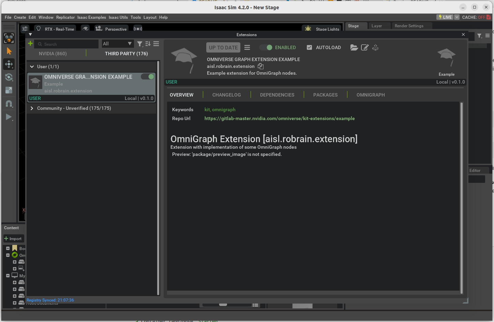

# Lang2Pose

> ✅ Tested on **Ubuntu 22.04** with **NVIDIA RTX 4090**

## Abstract

Lang2Pose is a modular robot control framework that interprets natural language commands for end-effector control and pick-and-place tasks.
Built on ROS 2, the system integrates:

- **Large Language Model (LLM):** Converts natural language into structured robot actions.
- **Perception Module:** Uses FoundationPose for 6D object pose estimation from RGB-D input and segmentation masks.
- **Motion Planning:** Employs Lula IK for simulation in Isaac Sim and MoveIt 2 for real-world execution.

We validate Lang2Pose with both simulated and real robots — a Kinova Gen3 arm and a Robotiq 2F-85 gripper. Simulations leverage high-fidelity physics in Isaac Sim, while real-world experiments use fine-tuned YOLO/YOLO-seg models and Realsense RGB-D data.
Lang2Pose enables intuitive language-driven manipulation and demonstrates robustness even under partial occlusion.

---

# Insatllation Guide

## 🧰 Isaac Sim Container Environment

Please set up and run Isaac Sim **using NVIDIA’s official container guide**:

👉 [Isaac Sim 4.2 — Container Installation & Run Guide](https://docs.isaacsim.omniverse.nvidia.com/4.2.0/installation/install_container.html)

**Checklist (quick sanity):**
- NVIDIA Driver installed & GPU accessible from Docker
- `nvidia-container-toolkit` configured
- Run with GPU runtime and X11 forwarding (GUI)
- Accept EULA and privacy consent env vars set (as required by the doc)
- Adequate shared memory (`/dev/shm`) and proper volume mounts

> Follow the exact steps and environment variables from the official doc for your OS/driver setup.


## 🤖 Robot USD File Setup

1. Download the robot USD file:
   👉 [Download Robot USD](https://drive.google.com/file/d/1ZIk-99ux3nmo-Qmjeu_wBMI5q0u4Va6E/view?usp=sharing)

2. Place the file at:

`resources/assets/robot.usd`

⚠️ Make sure the file is named exactly `robot.usd`!

## 🔑 API Key Setup

1. Create a `.env` file inside the following directory:

`resources/llmagent/.env`

2. Add your **OpenAI API Key** in the following format (replace with your actual key):

`OPENAI_API_KEY=sk-xxxxxxx...`

3. Make sure the file is named exactly .env and located in the resources/llmagent folder.
This file will be automatically loaded inside the container at runtime.

## 🚀 Usage

1. **Start the containers**

   ```bash
   docker compose up -d
    ```

2. **Enter the LLM agent container** (for natural language input)

    ```bash
    docker exec -it llmagent bash
    ```

3. **Wait for Isaac Sim to launch**, then inside the simulator:



* Go to **Window > Extensions > 3rd party > User**
* Find `aisl.robrain.extension` under 3rd party
* **Disable** it once, then **re-enable** it

4. Finally, open:

* **Isaac Examples → lang2pose**
* Start the demo 🎉

## 🚧 Upcoming Features

- **Vision-based Pick & Place**: Integration with the perception module for language-guided pick-and-place tasks will be released soon.
- **Real-World Demonstrations**: Experiments with the physical robot setup will be provided shortly.

---

# 🎥 Demo Videos

## **Simulation Demo**

[](https://youtu.be/4lVTTlVXPP0)

## **Real-World Demo**

[](https://www.youtube.com/shorts/txqpBssuc1s)
